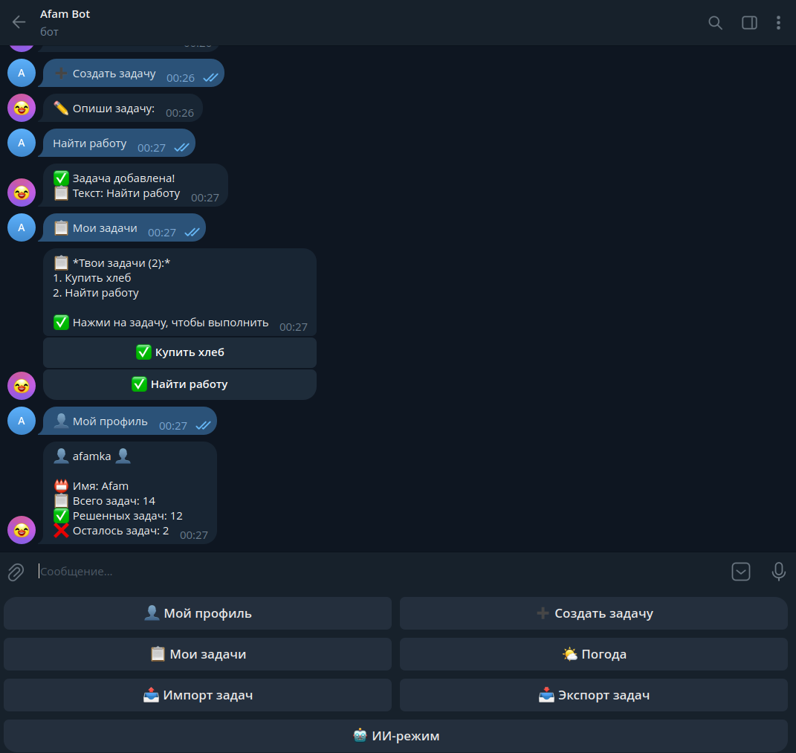
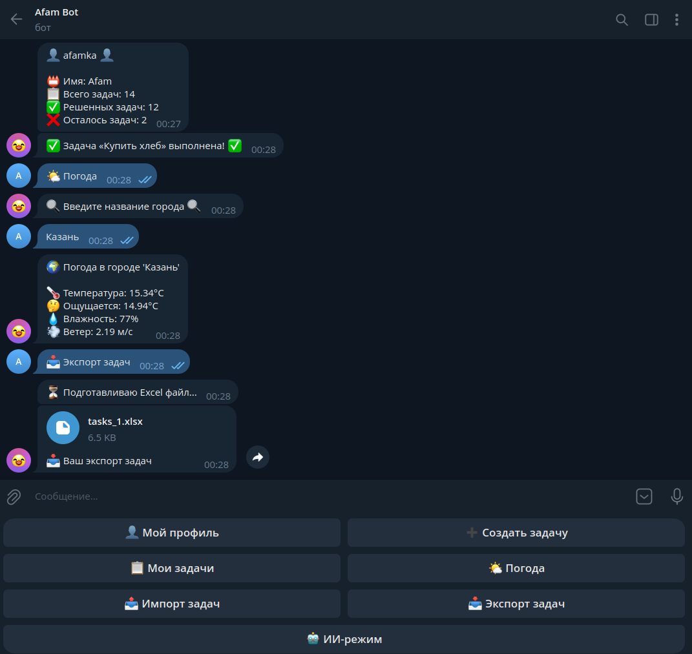

# 🤖 AI Telegram Assistant

Многофункциональный Telegram-бот с AI-ассистентом, системой задач, импортом Excel и прогнозом погоды.


---

👉 **Telegram Bot:** [@ai_afam_bot](https://t.me/ai_afam_bot)

---

## 📸 Скриншоты

<p align="center">
  
  
  
</p>

---

# ✨ Возможности

## 🤖 AI-ассистент

- Интеграция с DeepSeek API
- Генерация ответов в режиме диалога
- Имитация печати (`typing` action)
- Отдельный AI-режим внутри Telegram-бота

---

## 📋 Система задач

- Создание и выполнение задач
- Inline-клавиатуры для управления задачами
- Просмотр списка активных задач
- CRUD-логика через сервисный слой
- Хранение задач в MySQL

### 📤 Экспорт / импорт Excel

- Экспорт задач в `.xlsx`
- Импорт задач из Excel
- Асинхронная обработка через Laravel Queue
- Supervisor workers для фоновых задач

---

## 🌤️ Погода

Интеграция с OpenWeatherMap API:

- температура
- ощущается как
- влажность
- скорость ветра
- погодные условия

---

# 🧪 Тестирование

Проект покрыт feature-тестами.

Используется:

- PHPUnit
- Mockery
- Http::fake
- Queue::fake
- RefreshDatabase

Покрыты тестами:

- TaskService
- TelegramService
- WeatherService
- ImportService
- AIService
- KeyboardService
- UserService

```bash
php artisan test
```

# 🏗️ Backend архитектура
    Telegram Webhook
    Service Layer architecture
    Laravel Queue
    Redis
    Supervisor
    State machine
    REST API integrations
    VPS deployment
    HTTPS + Nginx

# 📂 Архитектура проекта
    Telegram
       ↓
    Webhook
       ↓
    Laravel Application
       ↓
    Services → Queue → DB
       ↓
    MySQL
    
    External APIs:
    - DeepSeek API
    - OpenWeatherMap API
    - Telegram Bot API
